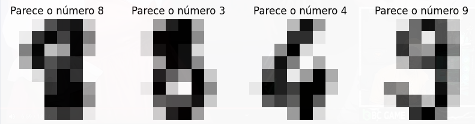

# Training AI to predict handwritten digits with Sklearn.Digits Dataset and KNN classifier

- Open project on vscode and install recommended extensions.
- Run `pip install -r requirements.txt`.
- *(Optional)* Draw a digit and save as a .png file inside `./digits` folder
- Open `main.ipynb` anc click on `Execute All` button.